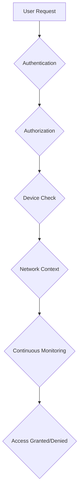

# Cybersecurity nel Settore Finanziario: Strategie Avanzate di Difesa

**Dr. Marco Rossi**  
*Dipartimento di Informatica, Università degli Studi di Milano*  
*Milano, Italia - 2024*

## Indice

1. [Introduzione alla Cybersecurity Finanziaria](#introduzione-alla-cybersecurity-finanziaria)
   1.1 [Il Paesaggio delle Minacce](#il-paesaggio-delle-minacce)
   1.2 [Impatto Economico degli Attacchi](#impatto-economico-degli-attacchi)
   1.3 [Framework Regolamentari](#framework-regolamentari)

2. [Architetture di Sicurezza Moderna](#architetture-di-sicurezza-moderna)
   2.1 [Zero Trust Architecture](#zero-trust-architecture)
   2.2 [Defense in Depth](#defense-in-depth)
   2.3 [Security by Design](#security-by-design)

3. [Threat Intelligence e Monitoraggio](#threat-intelligence-e-monitoraggio)
   3.1 [Cyber Threat Intelligence](#cyber-threat-intelligence)
   3.2 [Security Information and Event Management (SIEM)](#security-information-and-event-management-siem)
   3.3 [User and Entity Behavior Analytics (UEBA)](#user-and-entity-behavior-analytics-ueba)

4. [Crittografia e Protezione dei Dati](#crittografia-e-protezione-dei-dati)
   4.1 [Crittografia Post-Quantistica](#crittografia-post-quantistica)
   4.2 [Homomorphic Encryption](#homomorphic-encryption)
   4.3 [Secure Multi-Party Computation](#secure-multi-party-computation)

5. [Autenticazione e Identity Management](#autenticazione-e-identity-management)
   5.1 [Multi-Factor Authentication (MFA)](#multi-factor-authentication-mfa)
   5.2 [Biometric Authentication](#biometric-authentication)
   5.3 [Decentralized Identity](#decentralized-identity)

6. [Rilevamento e Risposta agli Incidenti](#rilevamento-e-risposta-agli-incidenti)
   6.1 [Incident Response Planning](#incident-response-planning)
   6.2 [Digital Forensics](#digital-forensics)
   6.3 [Threat Hunting](#threat-hunting)

7. [Sicurezza delle Infrastrutture Critiche](#sicurezza-delle-infrastrutture-critiche)
   7.1 [SCADA e ICS Security](#scada-e-ics-security)
   7.2 [Cloud Security](#cloud-security)
   7.3 [API Security](#api-security)

8. [Machine Learning per la Cybersecurity](#machine-learning-per-la-cybersecurity)
   8.1 [Anomaly Detection](#anomaly-detection)
   8.2 [Predictive Threat Modeling](#predictive-threat-modeling)
   8.3 [Automated Response Systems](#automated-response-systems)

9. [Compliance e Regulatory Technology](#compliance-e-regulatory-technology)
   9.1 [GDPR e Data Protection](#gdpr-e-data-protection)
   9.2 [SOX e Financial Reporting](#sox-e-financial-reporting)
   9.3 [RegTech Solutions](#regtech-solutions)

10. [Case Studies di Attacchi Cibernetici](#case-studies-di-attacchi-cibernetici)
    10.1 [Bangladesh Bank Heist (2016)](#bangladesh-bank-heist-2016)
    10.2 [Equifax Breach (2017)](#equifax-breach-2017)
    10.3 [SolarWinds Supply Chain Attack (2020)](#solarwinds-supply-chain-attack-2020)
    10.4 [Colonial Pipeline Ransomware (2021)](#colonial-pipeline-ransomware-2021)

11. [Quantum Computing e Futuro della Sicurezza](#quantum-computing-e-futuro-della-sicurezza)
    11.1 [Minacce Quantum](#minacce-quantum)
    11.2 [Quantum-Safe Cryptography](#quantum-safe-cryptography)
    11.3 [Quantum Key Distribution](#quantum-key-distribution)

12. [Best Practices e Strategie di Implementazione](#best-practices-e-strategie-di-implementazione)
    12.1 [Security Awareness Training](#security-awareness-training)
    12.2 [Red Team Exercises](#red-team-exercises)
    12.3 [Continuous Monitoring](#continuous-monitoring)

## 1. Introduzione alla Cybersecurity Finanziaria

Il settore finanziario rappresenta uno dei target più ambiti per gli attaccanti cibernetici, data la concentrazione di valore finanziario e dati sensibili. Secondo il rapporto IBM Cost of a Data Breach 2023, il costo medio di una violazione dei dati nel settore finanziario è di $5.9 milioni, significativamente superiore alla media globale.

### 1.1 Il Paesaggio delle Minacce

Le minacce cibernetiche nel settore finanziario includono:

- **Ransomware**: Attacchi che criptano dati critici richiedendo riscatto
- **Business Email Compromise (BEC)**: Frodi attraverso email spoofing
- **Supply Chain Attacks**: Compromission di fornitori terzi
- **Insider Threats**: Minacce provenienti da dipendenti o collaboratori
- **State-Sponsored Attacks**: Attacchi supportati da governi stranieri
- **Cryptocurrency-related Threats**: Hacking di exchange e wallet

### 1.2 Impatto Economico degli Attacchi

L'impatto degli attacchi cibernetici va oltre la perdita immediata di fondi:

| Tipo di Perdita | Costo Medio | Esempi |
|----------------|-------------|---------|
| Perdita di dati | $4.45M | Equifax breach |
| Interruzione operativa | $5.4M | Colonial Pipeline |
| Perdita di clienti | $1.6M | Trust erosion |
| Multa regolamentare | $2.1M | GDPR violations |
| **Totale** | **$13.55M** | **Per breach** |

### 1.3 Framework Regolamentari

Il settore finanziario è soggetto a molteplici framework regolamentari:

- **GDPR (EU)**: Protezione dati personali
- **SOX (USA)**: Financial reporting controls
- **PCI DSS**: Payment card industry standards
- **NIST Cybersecurity Framework**: Standard statunitensi
- **ISO 27001**: Information security management

## 2. Architetture di Sicurezza Moderna

### 2.1 Zero Trust Architecture

Il modello Zero Trust si basa sul principio "never trust, always verify":



**Componenti chiave:**
- **Identity Verification**: Continuoua autenticazione
- **Device Health Checks**: Valutazione sicurezza dispositivi
- **Micro-Segmentation**: Isolamento reti interne
- **Least Privilege Access**: Minimi privilegi necessari

### 2.2 Defense in Depth

Strategia multilivello di protezione:

```
┌─────────────────────────────────────┐
│         Perimeter Security          │
├─────────────────────────────────────┤
│       Network Segmentation          │
├─────────────────────────────────────┤
│     Endpoint Protection             │
├─────────────────────────────────────┤
│   Application Security              │
├─────────────────────────────────────┤
│      Data Protection                │
└─────────────────────────────────────┘
```

### 2.3 Security by Design

Integrazione sicurezza fin dalla progettazione:

- **Threat Modeling**: Identificazione rischi in fase di design
- **Secure Coding Practices**: Code review e static analysis
- **DevSecOps**: Integrazione sicurezza in CI/CD pipelines
- **Container Security**: Sicurezza ambienti containerizzati

## 3. Threat Intelligence e Monitoraggio

### 3.1 Cyber Threat Intelligence

Raccolta e analisi di informazioni sulle minacce:

**Fonti di Intelligence:**
- Open Source Intelligence (OSINT)
- Dark Web Monitoring
- Honeypots e Deception Technology
- Threat Actor Profiling

**Framework di Intelligence:**
- **MITRE ATT&CK**: Matrice tecniche di attacco
- **Diamond Model**: Modello relazioni attacco
- **Kill Chain**: Fasi di un attacco cibernetico

### 3.2 Security Information and Event Management (SIEM)

Piattaforme centralizzate per log analysis:

```python
# Esempio configurazione SIEM rule
siem_rule = {
    "name": "Suspicious Login Pattern",
    "description": "Multiple failed logins followed by success",
    "query": """
        SELECT user_id, COUNT(*) as failed_attempts
        FROM authentication_logs
        WHERE event_type = 'LOGIN_FAILED'
        AND timestamp > NOW() - INTERVAL '1 hour'
        GROUP BY user_id
        HAVING COUNT(*) > 5
    """,
    "severity": "HIGH",
    "response": "Block account and alert security team"
}
```

### 3.3 User and Entity Behavior Analytics (UEBA)

Machine learning per rilevamento comportamenti anomali:

**Applicazioni UEBA:**
- **User Behavior**: Pattern login, access patterns
- **Entity Behavior**: Device activity, network traffic
- **Peer Group Analysis**: Confronto con comportamenti simili
- **Risk Scoring**: Calcolo punteggio rischio in tempo reale

## 4. Crittografia e Protezione dei Dati

### 4.1 Crittografia Post-Quantistica

Preparazione per l'era del quantum computing:

**Algoritmi PQC:**
- **Lattice-based**: Kyber, Dilithium
- **Hash-based**: XMSS, LMS
- **Multivariate**: Rainbow
- **Code-based**: Classic McEliece

### 4.2 Homomorphic Encryption

Crittografia che permette computazioni su dati criptati:

```python
# Esempio concettuale homomorphic encryption
from phe import paillier

# Genera chiavi
public_key, private_key = paillier.generate_paillier_keypair()

# Cripta dati
encrypted_salary = public_key.encrypt(50000)
encrypted_bonus = public_key.encrypt(5000)

# Computazione su dati criptati
encrypted_total = encrypted_salary + encrypted_bonus

# Decripta risultato
total = private_key.decrypt(encrypted_total)
print(f"Total compensation: ${total}")  # $55,000
```

### 4.3 Secure Multi-Party Computation (SMPC)

Computazione collaborativa senza rivelare dati individuali:

**Protocolli SMPC:**
- **Secret Sharing**: Divisione segreti in parti
- **Garbled Circuits**: Computazione a due parti
- **Oblivious Transfer**: Trasferimento senza rivelare preferenze

## 5. Autenticazione e Identity Management

### 5.1 Multi-Factor Authentication (MFA)

Autenticazione multilivello:

**Fattori di Autenticazione:**
1. **Knowledge**: Qualcosa che sai (password, PIN)
2. **Possession**: Qualcosa che hai (telefono, token)
3. **Inherence**: Qualcosa che sei (biometria)
4. **Location**: Dove sei (geolocalizzazione)
5. **Behavior**: Come ti comporti (biometria comportamentale)

### 5.2 Biometric Authentication

Tecnologie biometriche avanzate:

| Tipo | Accuratezza | Vantaggi | Svantaggi |
|------|-------------|----------|-----------|
| Facial Recognition | 99.8% | Non invasivo | Lighting dependent |
| Iris Scanning | 99.9% | Alta sicurezza | Costoso |
| Voice Recognition | 98.5% | Remoto | Background noise |
| Fingerprint | 99.7% | Maturo | Skin conditions |
| Behavioral | 95-98% | Continuo | Calibration needed |

### 5.3 Decentralized Identity

Identity management basato su blockchain:

**Componenti DID:**
- **Decentralized Identifiers**: Identificatori auto-sovrani
- **Verifiable Credentials**: Credenziali crittograficamente verificabili
- **Zero-Knowledge Proofs**: Dimostrazione senza rivelare dati

## 6. Rilevamento e Risposta agli Incidenti

### 6.1 Incident Response Planning

Framework strutturato per risposta agli incidenti:

**Fasi NIRV (NIST):**
1. **Preparation**: Pianificazione e preparazione
2. **Identification**: Rilevamento e analisi
3. **Containment**: Isolamento e contenimento
4. **Eradication**: Rimozione minaccia
5. **Recovery**: Ripristino e monitoraggio
6. **Lessons Learned**: Analisi post-incidente

### 6.2 Digital Forensics

Investigazione scientifica di incidenti cibernetici:

**Artefatti Digitali:**
- **Volatile Data**: Memoria RAM, processi attivi
- **File System**: File, metadati, timestamps
- **Network Logs**: Traffico, connessioni
- **Registry/System Logs**: Eventi di sistema

### 6.3 Threat Hunting

Ricerca proattiva di minacce nascoste:

**Metodologie:**
- **Hypothesis-driven Hunting**: Ricerca basata su ipotesi
- **Data-driven Hunting**: Analisi pattern in big data
- **Intelligence-driven Hunting**: Uso threat intelligence
- **Automation-assisted Hunting**: Strumenti automatizzati

## 7. Sicurezza delle Infrastrutture Critiche

### 7.1 SCADA e ICS Security

Sicurezza sistemi di controllo industriali:

**Vulnerabilità SCADA:**
- **Legacy Systems**: Sistemi obsoleti non patchati
- **Network Segmentation**: Mancanza isolamento
- **Default Credentials**: Password di default
- **Remote Access**: Accesso remoto non sicuro

### 7.2 Cloud Security

Sicurezza ambienti cloud finanziari:

**Modelli di Responsabilità:**
- **IaaS**: Cliente responsabile OS e applicazioni
- **PaaS**: Provider gestisce infrastruttura
- **SaaS**: Provider gestisce tutto tranne dati

**Best Practices:**
- **Encryption at Rest/Transit**: Crittografia dati
- **Identity Management**: IAM avanzato
- **Network Security**: Security groups, WAF
- **Monitoring**: CloudTrail, CloudWatch

### 7.3 API Security

Protezione delle API critiche:

**Threats API:**
- **Injection Attacks**: SQL injection, command injection
- **Broken Authentication**: Session management debole
- **Excessive Data Exposure**: Over-posting dati sensibili
- **Rate Limiting Bypass**: Abuso API limits

## 8. Machine Learning per la Cybersecurity

### 8.1 Anomaly Detection

Rilevamento comportamenti anomali:

```python
from sklearn.ensemble import IsolationForest
from sklearn.preprocessing import StandardScaler
import pandas as pd

class AnomalyDetector:
    def __init__(self, contamination=0.1):
        self.scaler = StandardScaler()
        self.model = IsolationForest(contamination=contamination, random_state=42)

    def fit(self, data):
        scaled_data = self.scaler.fit_transform(data)
        self.model.fit(scaled_data)

    def predict(self, data):
        scaled_data = self.scaler.transform(data)
        predictions = self.model.predict(scaled_data)
        # -1 = anomaly, 1 = normal
        return predictions

# Esempio utilizzo
detector = AnomalyDetector()

# Features: amount, frequency, location_anomaly, time_anomaly
transaction_features = pd.DataFrame({
    'amount': [100, 5000, 50, 200, 10000, 75],
    'frequency': [1, 15, 2, 3, 25, 1],
    'location_anomaly': [0, 1, 0, 0, 1, 0],
    'time_anomaly': [0, 0, 1, 0, 1, 0]
})

detector.fit(transaction_features)
anomalies = detector.predict(transaction_features)
print("Anomaly predictions:", anomalies)
```

### 8.2 Predictive Threat Modeling

Previsione future minacce:

**Approcci:**
- **Time Series Forecasting**: Predizione attacchi futuri
- **Graph Analytics**: Analisi relazioni tra entità
- **Natural Language Processing**: Analisi threat reports
- **Ensemble Methods**: Combinazione modelli predittivi

### 8.3 Automated Response Systems

Risposta automatica agli incidenti:

**SOAR (Security Orchestration, Automation and Response):**
- **Playbooks**: Workflow automatizzati
- **Case Management**: Tracking incidenti
- **Integration**: Connessione tool di sicurezza
- **Analytics**: Report e metriche

## 9. Compliance e Regulatory Technology

### 9.1 GDPR e Data Protection

Compliance con regolamentazione europea:

**Principi GDPR:**
- **Lawfulness, Fairness, Transparency**: Trattamento lecito e trasparente
- **Purpose Limitation**: Finalità specifiche e legittime
- **Data Minimization**: Dati adeguati e pertinenti
- **Accuracy**: Dati esatti e aggiornati
- **Storage Limitation**: Conservazione limitata nel tempo
- **Integrity and Confidentiality**: Sicurezza e riservatezza
- **Accountability**: Responsabilità del trattamento

### 9.2 SOX e Financial Reporting

Controlli interni per reporting finanziario:

**Requisiti SOX:**
- **Internal Controls**: Sistemi controllo interno
- **Risk Assessment**: Valutazione rischi
- **Information Technology Controls**: Controlli IT
- **Monitoring**: Monitoraggio continuo

### 9.3 RegTech Solutions

Tecnologia per compliance regolamentare:

**Applicazioni RegTech:**
- **Automated Reporting**: Generazione report regolamentari
- **KYC/AML Automation**: Verifica clienti automatizzata
- **Regulatory Change Management**: Tracking aggiornamenti normativi
- **Compliance Monitoring**: Monitoraggio continuo conformità

## 10. Case Studies di Attacchi Cibernetici

### 10.1 Bangladesh Bank Heist (2016)

**Contesto:** Furto di $81 milioni dalla banca centrale del Bangladesh attraverso SWIFT network.

**Metodo di Attacco:**
- Compromissione credenziali SWIFT
- Malware personalizzato per manipolare transazioni
- Routing attraverso casinò filippini per money laundering

**Lezioni Apprese:**
- Importanza autenticazione forte
- Necessità monitoraggio transazioni in tempo reale
- Limiti sistemi legacy

### 10.2 Equifax Breach (2017)

**Contesto:** Violazione dati di 147 milioni di persone negli Stati Uniti.

**Metodo di Attacco:**
- Vulnerabilità Apache Struts non patchata
- Accesso database contenente dati sensibili
- Mancanza segmentazione rete adeguata

**Lezioni Apprese:**
- Importanza patch management
- Necessità encryption dati a riposo
- Responsabilità disclosure tempestivo

### 10.3 SolarWinds Supply Chain Attack (2020)

**Contesto:** Compromissione supply chain di SolarWinds Orion platform.

**Metodo di Attacco:**
- Iniezione malware in aggiornamenti software
- Accesso a 18,000 organizzazioni incluse agenzie governative
- Attore statale (APT29/Cozy Bear)

**Lezioni Apprese:**
- Rischio supply chain attacks
- Importanza software bill of materials (SBOM)
- Necessità zero trust architecture

### 10.4 Colonial Pipeline Ransomware (2021)

**Contesto:** Attacco ransomware che interruppe distribuzione carburante USA est.

**Metodo di Attacco:**
- Compromissione VPN con password debole
- DarkSide ransomware group
- Richiesta riscatto $4.4 milioni

**Lezioni Apprese:**
- Importanza multifactor authentication
- Necessità backup isolati
- Impatto infrastrutture critiche

## 11. Quantum Computing e Futuro della Sicurezza

### 11.1 Minacce Quantum

L'avvento del quantum computing minaccia la crittografia attuale:

**Algoritmi Quantum Threat:**
- **Shor's Algorithm**: Fattorizzazione numeri grandi (RSA)
- **Grover's Algorithm**: Ricerca in database non strutturati
- **Quantum Fourier Transform**: Breaking periodic functions

### 11.2 Quantum-Safe Cryptography

Crittografia resistente agli attacchi quantum:

**Standard NIST PQC:**
- **CRYSTALS-Kyber**: Key encapsulation mechanism
- **CRYSTALS-Dilithium**: Digital signatures
- **FALCON**: Alternative digital signatures
- **SPHINCS+**: Hash-based signatures

### 11.3 Quantum Key Distribution

Distribuzione chiavi basata su principi quantistici:

**Protocolli QKD:**
- **BB84**: Protocollo base QKD
- **E91**: QKD basato su entanglement
- **Continuous Variable QKD**: Implementazione pratica
- **Device-Independent QKD**: Sicurezza assoluta

## 12. Best Practices e Strategie di Implementazione

### 12.1 Security Awareness Training

Formazione personale su sicurezza:

**Programmi Efficaci:**
- **Phishing Simulation**: Test regolari phishing
- **Social Engineering Training**: Riconoscimento manipolazione
- **Password Hygiene**: Gestione password sicure
- **Incident Reporting**: Procedure segnalazione

### 12.2 Red Team Exercises

Simulazione attacchi per testare difese:

**Tipi di Esercizi:**
- **Red Team Assessment**: Attacchi completi
- **Purple Team**: Collaborazione red/blue team
- **Tabletop Exercises**: Discussione scenari teorici
- **Automated Testing**: Strumenti vulnerability scanning

### 12.3 Continuous Monitoring

Monitoraggio costante dell'ambiente:

**Metriche Chiave:**
- **MTTD (Mean Time to Detect)**: Tempo medio rilevamento
- **MTTR (Mean Time to Respond)**: Tempo medio risposta
- **Security Score**: Punteggio sicurezza complessivo
- **Compliance Rate**: Percentuale conformità policy

## Conclusioni

La cybersecurity nel settore finanziario richiede un approccio multidimensionale che integri tecnologia avanzata, processi operativi solidi e cultura della sicurezza. Mentre le minacce continuano ad evolversi, le istituzioni finanziarie devono adottare strategie proattive che includano:

1. **Architetture Zero Trust** per eliminare fiducia implicita
2. **Machine Learning** per rilevamento automatico minacce
3. **Crittografia Quantum-Safe** per preparazione futuro
4. **Threat Intelligence** per awareness proattiva
5. **Regulatory Compliance** integrata nei processi

L'investimento in cybersecurity non è più una scelta opzionale ma una necessità strategica per la sopravvivenza nel panorama finanziario digitale.

---

## Bibliografia

1. **NIST Cybersecurity Framework** (2023). National Institute of Standards and Technology.

2. **MITRE ATT&CK Framework** (2023). Mitre Corporation.

3. **IBM Cost of a Data Breach Report** (2023). IBM Security.

4. **Verizon Data Breach Investigations Report** (2023). Verizon.

5. **ENISA Threat Landscape** (2023). European Union Agency for Cybersecurity.

---

*Questo documento è fornito esclusivamente a scopo informativo ed educativo. Le informazioni contenute rappresentano lo stato dell'arte al momento della pubblicazione e possono evolvere rapidamente nel campo della cybersecurity.*